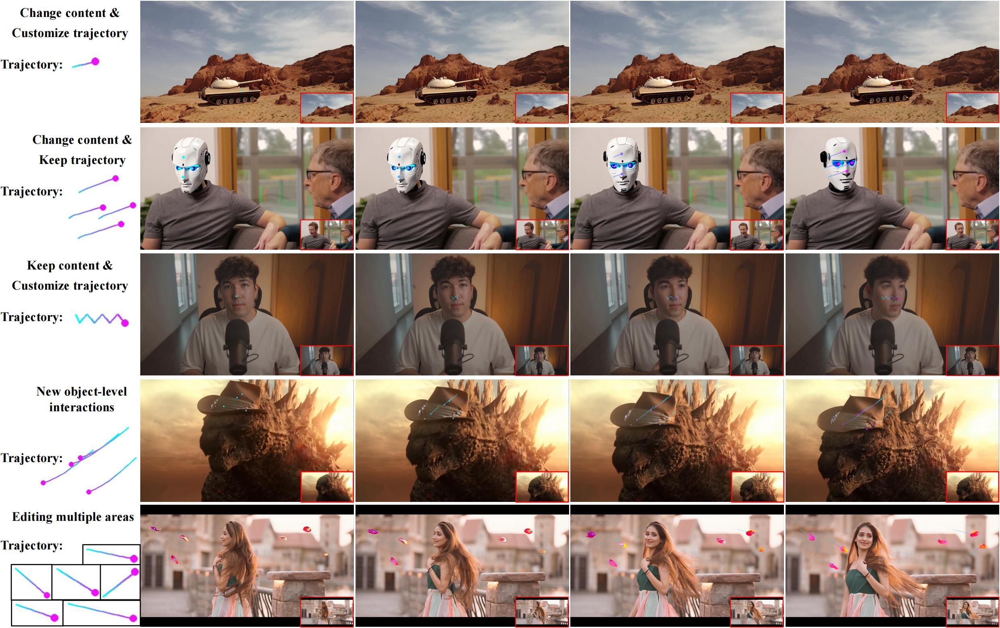

# ReVideo: Remake a Video with Motion and Content Control
[Chong Mou](https://scholar.google.com/citations?user=SYQoDk0AAAAJ&hl=zh-CN),
[Mingdeng Cao](https://scholar.google.com/citations?user=EcS0L5sAAAAJ&hl=en),
[Xintao Wang](https://xinntao.github.io/),
[Zhaoyang Zhang](https://zzyfd.github.io/),
[Ying Shan](https://scholar.google.com/citations?user=4oXBp9UAAAAJ),
[Jian Zhang](https://jianzhang.tech/)

---
## Introduction
ReVideo aims to solve the problem of local video editing. The editing target includes visual content and motion trajectory modifications.

  

## 📰 **New Features/Updates**
- [2024/05/23] Paper and project page of **ReVideo** are available.

## ✏️ Todo
- [ ] Code will be open-sourced in June

## 🔥🔥🔥 Main Features
### Change content & Customize motion trajectoy
<table class="center">
<tr>
  <td style="text-align:center;"><b>Input Video</b></td>
  <td style="text-align:center;"><b>Editing Result</b></td>
</tr>
<tr>
  <td><video src="https://github.com/MC-E/DragonDiffusion/assets/54032224/222f35da-7396-4989-a3c3-9ab4a2e5fa98" autoplay></td>
  <td><video src="https://github.com/MC-E/DragonDiffusion/assets/54032224/c128f1d7-30e4-49e7-b6b7-9d5f428ff882" autoplay></td>
</tr>
</table>

### Change content & Keep motion trajectoy
<table class="center">
<tr>
  <td style="text-align:center;"><b>Input Video</b></td>
  <td style="text-align:center;"><b>Editing Result</b></td>
</tr>
<tr>
  <td><video src="https://github.com/MC-E/DragonDiffusion/assets/54032224/d25dce6a-88cf-45ad-9177-76df9fffe819" autoplay></td>
  <td><video src="https://github.com/MC-E/DragonDiffusion/assets/54032224/06c8f19d-4569-417f-a4a3-1782a09404db" autoplay></td>
</tr>
</table>

### Keep content & Customize motion trajectoy
<table class="center">
<tr>
  <td style="text-align:center;"><b>Input Video</b></td>
  <td style="text-align:center;"><b>Editing Result</b></td>
</tr>
<tr>
  <td><video src="https://github.com/MC-E/DragonDiffusion/assets/54032224/490b4e9b-c1af-4f87-83de-c6b27f4a925b" autoplay></td>
  <td><video src="https://github.com/MC-E/DragonDiffusion/assets/54032224/93f77c7b-23a8-4b1e-8e6d-1abf57fd1130" autoplay></td>
</tr>
</table>

### Multi-area Editing
<table class="center">
<tr>
  <td style="text-align:center;"><b>Input Video</b></td>
  <td style="text-align:center;"><b>Editing Result</b></td>
</tr>
<tr>
  <td><video src="https://github.com/MC-E/DragonDiffusion/assets/54032224/339263b6-ea97-4c43-8617-b40459b1973c" autoplay></td>
  <td><video src="https://github.com/MC-E/DragonDiffusion/assets/54032224/7a005b3a-ff3e-492c-9643-0fd921b0b53e" autoplay></td>
</tr>
</table>

## Related Works

[1] <a href="https://pika.art/">https://pika.art/</a>

[2] <a href="https://arxiv.org/abs/2308.08089">DragNUWA: Fine-grained Control in Video Generation by Integrating Text, Image, and Trajectory</a>

[3] <a href="https://arxiv.org/abs/2403.07420">
    DragAnything: Motion Control for Anything using Entity Representation</a>

[4] <a href="https://arxiv.org/abs/2403.14468/">AnyV2V: A Plug-and-Play Framework For Any Video-to-Video Editing Tasks</a>

# 🤗 Acknowledgements
We appreciate the releasing code of [Stable Video Diffusion](https://github.com/Stability-AI/generative-models).
